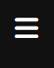
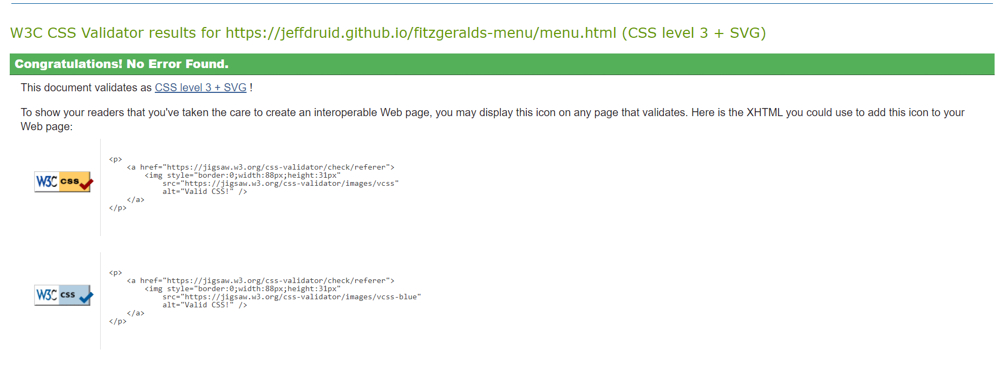
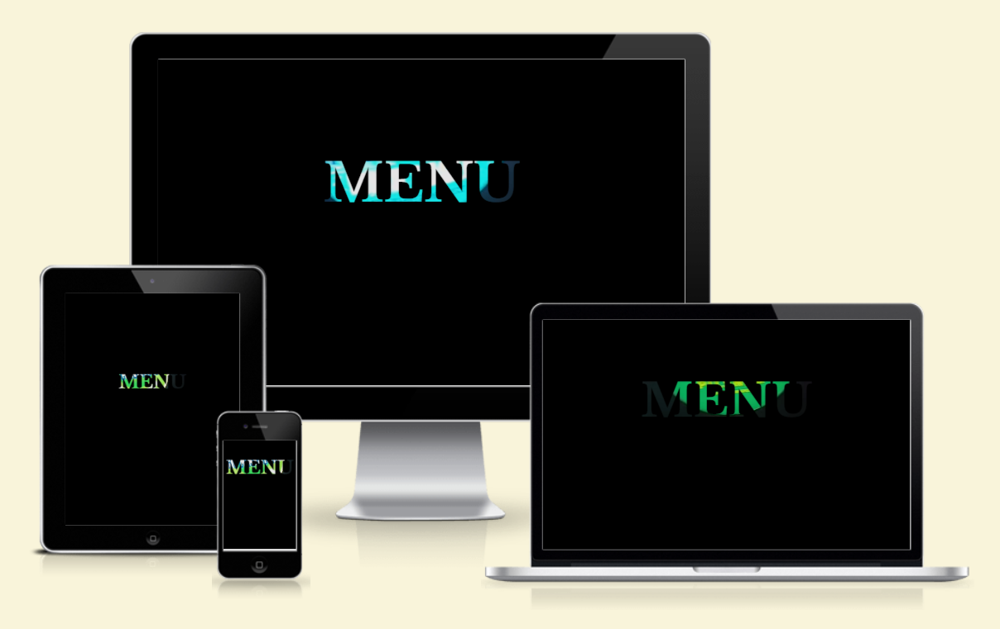

# Fitzgerald Bar Drinks Menu

This project aims to create a digital menu for Fitzgerald's Bar, being accessible via a QR code.

## Table of Contents

1. [Introduction](#introduction)
1. [Technologies Used](#technologies-used)
1. [Features](#features)
    - [Index](#index)
    - [Menu](#menu)
    - [Navbar](#navbar)
    - [About](#about)
    - [Contact](#contact)
1. [Wireframe](#wireframe)
1. [Testing](#testing)
    - [Validator Testing](#validator-testing)
        - [HTML](#html)
        - [CSS](#css)
    - [Accessibility](#accessibility)
    - [Responsiveness](#responsiveness)
    - [Manual Testing](#manual-testing)
        - [Desktop](#desktop)
        - [Mobile & Tablet](#mobile--tablet)
1. [Deployment](#Deployment)
    - [Cloning & Forking](#cloning--forking)
    - [Local Deployment](#local-deployment)
    - [Remote Deployment](#remote-deployment)
1. [Credits](#credits)
    - [Source Code](#source-code)
    - [Icons](#icons)
    - [Images](#images)
    - [Useful links](#useful-links)

## Introduction

Fitzgerald's Bar currently lacks a digital drinks menu, causing inconvenience for customers who have to physically go to the bar to view available drinks. This project aims to solve this problem by providing an interactive, user-friendly digital drinks menu accessible via QR code.

## Technologies Used

- HTML5
- CSS3

## Wireframe

## Features

- ### Index

Clicking on the "MENU" heading navigates the user to the meu.html page.
Background video starts playing once the page loads, it is set to autoplay, mute and loop.

- ### Menu

Display various drinks available at Fitzgerlads bar.

 

Each card have an image of the drinks with name, alcohol percentage and price.

Cards have overlays providing additional details upon hover/clicked (mobile)

Contains links to social media platforms

- ### Navbar

 

Provides site's title and navigation links for the menu, about and contact pages

Menu active, showing the current page the user is on.

Menu icon, displayed on mobile devices.

- ### About

About active, showing the current page the user is on.

Contains information about the bar.

- ### Contact

Contact active, showing the current page the user is on.

Contains a contact form for users to send messages.

Contains a form where users are able to enter their name, email and message, allowing them to contact the bar.

 

Prevents user to submit a form without name. 

 

Prevents user to submit a form without email.

Prevents user to submit a form without a message.

Displays location of the bar using embedded map.

## Testing

### Validator Testing

- #### HTML
    - [W3C Validator - Index](https://validator.w3.org/nu/?doc=https%3A%2F%2Fjeffdruid.github.io%2Ffitzgeralds-menu%2Findex.html)
    - [W3C Validator - Menu](https://validator.w3.org/nu/?doc=https%3A%2F%2Fjeffdruid.github.io%2Ffitzgeralds-menu%2Fmenu.html)
    - [W3C Validator - About](https://validator.w3.org/nu/?doc=https%3A%2F%2Fjeffdruid.github.io%2Ffitzgeralds-menu%2Fabout.html)
    - [W3C Validator - Contact](https://validator.w3.org/nu/?doc=https%3A%2F%2Fjeffdruid.github.io%2Ffitzgeralds-menu%2Fcontact.html)

- #### CSS
    - [Jigsaw Validator - CSS](https://jigsaw.w3.org/css-validator/validator?uri=https%3A%2F%2Fjeffdruid.github.io%2Ffitzgeralds-menu%2F&profile=css3svg&usermedium=all&warning=1&vextwarning=&lang=en)
    

- #### Accessibility

 Lighthouse results from Google Devtools

#### Responsiveness

Screenshots of the various device breakpoints for responsive design.

Viewport - Desktop: 1600x992px / Laptop: 1280x802px / Tablet: 768x1024px / Mobile: 320x480px.

 
 
 

### Manual Testing

The manual testing conducted on the page includes the following aspects:

- #### Cross-browser Compatibility:

    - Verified the functionality of the page across different web browsers to ensure it works properly and it is consistent.

- #### Responsiveness and Device Compatibility:

    - Verified that the project displays correctly and functions appropriately across various device sizes, ensuring a good user experience.

- #### Link Validation:

    - Verified all internal and external links to ensure they direct users to the intended destinations and open correctly without issues.

- #### Text and Font Readability:

    - Verified that all text content and fonts used on the page are legible, clear, and easy to understand.

 The manual testing confirms that the page operates smoothly across multiple browsers, adapts well to different devices, ensures accurate link navigation, and maintains clear readability for users interacting with the content.

- ### Desktop

- ### Mobile & Tablet

## Deployment

### Cloning & Forking
#### Forking a Repository
1. Visit [Fitzgerald's Menu](https://github.com/jeffdruid/fitzgeralds-menu) 
2. Click on the "Fork" button located in the top-right corner of the page.
3. Provide a description for your fork.
4. Select "Create fork".

#### Cloning a Repository
1. Navigate to the repository on Github and click the "Code" button located above the list of files.
2. Copy the repository's URL.
3. Open Terminal and change the directory to where you want the cloned directory.
4. Enter "git clone" then paste the URL.

### Local Deployment

### Remote Deployment
To deploy the site on GitHub Pages after forking or cloning:

1. Go to your repository on GitHub.
2. Access the settings tab.
3. Click on the "Pages'tab in the left sidebar.
4. Under the "Build and Deployment" section, select "main" from the source drop-down list.
5. The page will display the link to the deployed website.

You can access the live link here : [Fitzgerald's Menu](https://jeffdruid.github.io/fitzgeralds-menu/index.html)

## Credits

### Source code 

- [Stack Overflow - Changing hover to touch for mobile devices](https://stackoverflow.com/questions/22559756/changing-hover-to-touch-click-for-mobile-devices)
- [W3Schools - Pseudo classes](https://www.w3schools.com/css/css_pseudo_classes.asp)
- [CodePen - Card Overlay](https://codepen.io/sstromick/pen/qBOeypG)
- [Love Running - Navigation Bar](https://github.com/Code-Institute-Solutions/love-running-v3)
- [MDN - Using CSS Transitions](https://developer.mozilla.org/en-US/docs/Web/CSS/CSS_transitions/Using_CSS_transitions)
- [W3CSchools - Transitions](https://www.w3schools.com/css/css3_transitions.asp )
- [CSS Tricks - Full-page background video styles](https://css-tricks.com/full-page-background-video-styles)
- [We Tech Talk - Creating a Masonry](https://www.youtube.com/watch?v=-isQPqqnIBo)
- [Formspree - Form Submission](https://formspree.io/)

### Images

- [Pexels - Thiago Miranda](https://images.pexels.com/photos/1478386/pexels-photo-1478386.jpeg?auto=compress&cs=tinysrgb&w=1260&h=750&dpr=1)
- [Pexels - Thgusstavo Santana](https://images.pexels.com/photos/2286972/pexels-photo-2286972.jpeg?auto=compress&cs=tinysrgb&w=1260&h=750&dpr=1)
- [Pexels - Guillaume Meurice](https://images.pexels.com/photos/1932514/pexels-photo-1932514.jpeg?auto=compress&cs=tinysrgb&w=1260&h=750&dpr=1)
- [Pexels - Wallace Chuck](https://images.pexels.com/photos/2565587/pexels-photo-2565587.jpeg?auto=compress&cs=tinysrgb&w=1260&h=750&dpr=1)
- [Pexels - Mwabonje Ringa ](https://images.pexels.com/photos/1694853/pexels-photo-1694853.jpeg?auto=compress&cs=tinysrgb&w=1260&h=750&dpr=1)
- [Pexels - Victor Cayke](https://images.pexels.com/photos/17409432/pexels-photo-17409432/free-photo-of-cans-of-beer-in-dew.jpeg?auto=compress&cs=tinysrgb&w=1260&h=750&dpr=1)
- [Pexels - Raynnier Gomez ](https://images.pexels.com/photos/15901846/pexels-photo-15901846/free-photo-of-cold-corona-beer.jpeg?auto=compress&cs=tinysrgb&w=1260&h=750&dpr=1)
- [Pexels - Brett Jordan](https://images.pexels.com/photos/5017804/pexels-photo-5017804.jpeg?auto=compress&cs=tinysrgb&w=1260&h=750&dpr=1)
- [Pexels - S. von Hoerst](https://images.pexels.com/photos/9550788/pexels-photo-9550788.jpeg?auto=compress&cs=tinysrgb&w=1260&h=750&dpr=1)
- [Pexels - ТАРКОС ](https://images.pexels.com/photos/7220272/pexels-photo-7220272.jpeg?auto=compress&cs=tinysrgb&w=1260&h=750&dpr=1)
- [Pexels - Brett Jordan ](https://images.pexels.com/photos/11930130/pexels-photo-11930130.jpeg?auto=compress&cs=tinysrgb&w=1260&h=750&dpr=1)

### Icons

- [FontAwesome](https://fontawesome.com/)

### Useful Links

- [Flipsnack - Menu design ideas: 10 mouth-watering menu fonts](https://blog.flipsnack.com/menu-design-ideas-10-menu-fonts/)
- [NicePage - Black/White Theme](https://nicepage.com/s/79786/black-and-white-colors-of-art-css-template)